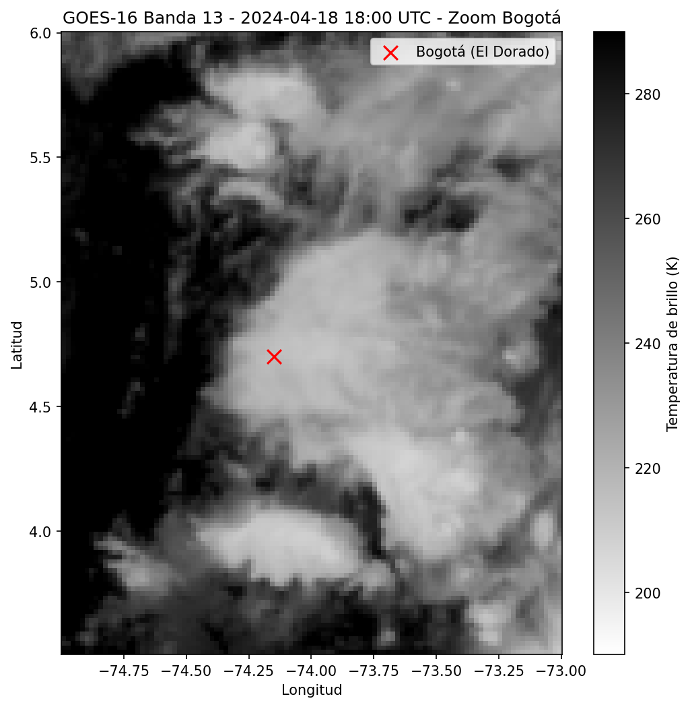

# Primera exploración de datos GOES-16 — Memo de avance

**Fecha de trabajo:** sesión de exploración inicial
**Archivo de datos:** `datos/RadFC_20240418180020.nc`
**Caso:** 2024-04-18, 18:00 UTC (13:00 hora Bogotá)

## Contexto

Este timestamp corresponde al inicio del evento de lluvia fuerte identificado en la fase de selección de fechas. El reporte METAR de SKBO para esta hora registraba:

```
METAR SKBO 181800Z 24010KT 5000 TS VCSH FEW017CB SCT023 21/13 Q1026 NOSIG RMK CB
```

Es decir: tormenta eléctrica activa (`TS`), chubascos en vecindades (`VCSH`), y cumulonimbus (`CB`) reportado visualmente desde el aeropuerto. Visibilidad reducida a 5 km, consistente con presencia de precipitación cercana.

## Procedimiento

1. Se abrió el archivo recortado (`RadFC_20240418180020.nc`) con `xarray`, confirmando la estructura: grilla 920×920 píxeles, variables `Rad8`, `Rad9`, `Rad10`, `Rad13`, `Rad14` (radiancias crudas), más `lat`/`lon`.

2. Se identificó que el archivo recortado **no conserva los atributos globales** del archivo original de NOAA, incluyendo los coeficientes de Planck necesarios para convertir radiancia a temperatura de brillo.

3. Se descargó por separado, usando la librería `GOES` directamente, el archivo original sin recortar de banda 13 para el mismo timestamp (`OR_ABI-L1b-RadF-M6C13_G16_s20241091800203...nc`), del cual se extrajeron los coeficientes:

   | Coeficiente | Valor |
   |---|---|
   | `planck_fk1` | 10803.30 |
   | `planck_fk2` | 1392.74 |
   | `planck_bc1` | 0.0755 |
   | `planck_bc2` | 0.99975 |

4. Se aplicó la fórmula estándar de conversión radiancia → temperatura de brillo (Schmit et al., 2010):

   ```
   BT = (fk2 / ln((fk1 / Rad) + 1) - bc1) / bc2
   ```

   a la variable `Rad13` del archivo recortado.

## Resultados

**Estadísticas de temperatura de brillo (banda 13, todo el recorte de Colombia y alrededores):**

| | Valor |
|---|---|
| Mínimo | 186.7 K (≈ −86 °C) |
| Máximo | 314.5 K (≈ 41 °C) |
| Media | 262.0 K (≈ −11 °C) |

El mínimo es notablemente más frío que el rango "típico" de tope convectivo (200–220 K) discutido en el marco teórico — indica un sistema muy desarrollado, con tope cercano o por encima de la tropopausa tropical.

**Visualización (zoom a la región de Bogotá, `vmin=190`, `vmax=290`):**



Se observa una masa de nube fría (~200–220 K, tonos claros) que cubre la totalidad de la Sabana de Bogotá, con el punto de El Dorado ubicado en el borde/centro del sistema. Un segundo núcleo convectivo separado es visible al sureste (~lat 4°, lon −73.7°). Las zonas oscuras (cálidas, ~280–290 K) corresponden a superficie despejada fuera del sistema.

## Interpretación

Este resultado conecta de forma directa la evidencia satelital con la evidencia de superficie (METAR): en el mismo timestamp en que SKBO reportaba tormenta activa y cumulonimbus, la banda 13 muestra un sistema convectivo extenso y frío cubriendo exactamente esa región. Es la primera validación empírica, con datos propios, de que la señal de banda 13 es consistente con eventos de lluvia fuerte reportados en tierra — el principio sobre el cual se apoya toda la propuesta de nowcasting.

## Hallazgo técnico para el mapa del repo

El script `get_cut_compress.py` no propaga los atributos globales ni las variables de calibración (coeficientes de Planck) al archivo recortado. Esto es funcional para visualización de radiancias crudas, pero **limita el análisis físico directo** (conversión a temperatura de brillo) sin un paso adicional de descarga del archivo original.

**Adaptación pendiente:** modificar el script para incluir los coeficientes `planck_fk1`, `planck_fk2`, `planck_bc1`, `planck_bc2` (y posiblemente `kappa0`, `esun` para bandas reflectivas si se usaran en el futuro) como variables o atributos del archivo de salida recortado, evitando la necesidad de una descarga adicional del archivo Full Disk completo.

## Siguiente paso

Con la descarga del día completo (2024-04-18) en proceso, el siguiente paso es repetir este análisis para un timestamp despejado (mañana del mismo día, ~12:00 UTC) y construir una comparación visual lado a lado: cielo despejado vs. sistema convectivo activo, usando el mismo rango de temperatura de brillo para ambas imágenes.